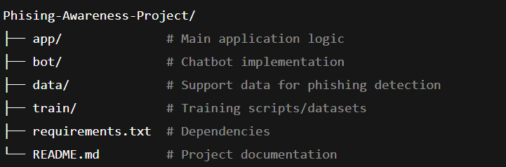

📌 Phishing Awareness Project

A chatbot designed to educate users about scams and help identify phishing attempts, including suspicious messages and links. This tool aims to improve cybersecurity awareness and help people spot fraud attempts more effectively. 
GitHub

🧠 Features

💬 Interactive Chatbot: Conversational interface to educate users on different types of phishing scams.

🔍 Phishing Analysis: Checks messages/links and assesses whether they may be phishing or fraud.

📚 Awareness Focused: Provides users with tips and guidance to avoid falling for scams.

🚀 Technology Stack
Component	Technology
Bot / Chat Interface	Python
Data	Training data for phishing detection
Backend Logic	Custom analysis model
Requirements	Third-party Python libraries
📦 Installation

Clone the repository

git clone https://github.com/YASHRAWAT-1611/Phising-Awareness-Project.git
cd Phising-Awareness-Project

Create a Python virtual environment

python3 -m venv venv
source venv/bin/activate   # macOS/Linux
venv\Scripts\activate      # Windows

Install dependencies

pip install -r requirements.txt

🧩 How to Use

Make sure your Python environment is active.

Run the chatbot application:

uvicorn app.main:app    #in new terminal

python bot\bot.py   #in new terminal

Interact with the bot to learn about phishing and analyze text/links.

The bot should respond with guidance or flag suspicious content.

📄 Project Structure

📌 Contributing

Contributions are welcome!🙌
To contribute:

Fork the repository

Create a new feature branch

Commit your changes

Open a pull request

Make sure your code follows best practices and add tests where applicable.

💡 Future Enhancements

Add a web UI interface for easier access

Improve detection accuracy using machine learning

Provide real-time link verification using APIs

Add support for multiple languages

📜 License

This project currently does not list a license. You can add an open-source license like MIT License or Apache 2.0 based on your preference.

❤️ Acknowledgements

Thanks to all contributors and everyone who provided feedback during development.